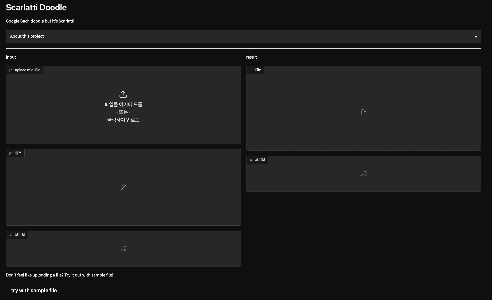
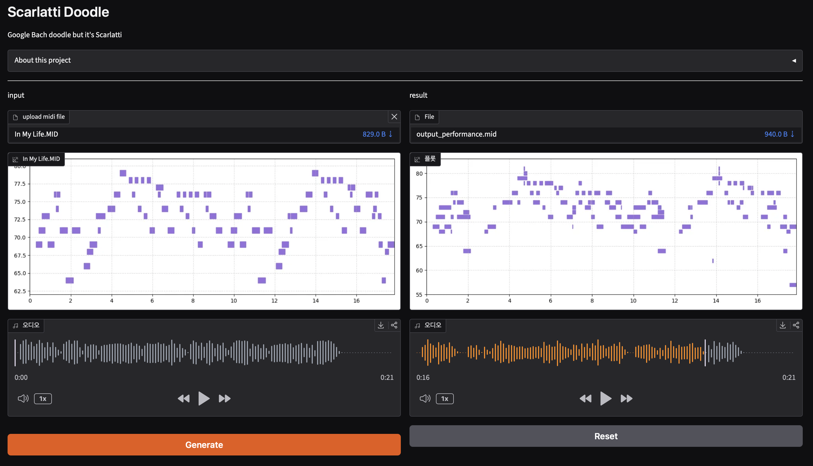

# scarlatti-doodle

I made a Scarlatti version of the Google Bach doodle. You upload your melody midi file, scarlatti doodle turns it into a Scarlatti Sonata! I trained my own UNet model for this project! 

### Screenshots

  
  

<video controls src="https://cdn.hackclub.com/01a02383-382f-7724-b31e-7abfb2e57ac9/screenrecording_08-21-2026_17-48-43_1.mp4" title="video.MP4"></video>

### Tech stack
- midi file processing - partitura
- key detection - music21
- model training - numpy, pytorch
- interface - gradio
- scarlatti sonata midi dataset - www.kunstderfuge.com

### Motivation
 when I was a kid, I came across Google Bach doodle, which turned melody into Bach style ones. I thought it was really cool. Around that time, I was practicing a piece by Scarlatti(sonata k531 to be exact!) on piano. I really wanted to make an AI model that is similar to Google Bach doodle but with Scarlatti's sonata. So few years later now, I finally made it!

### How it works
 1. When a midi file is uploaded, it is transformed into numpy array, and is processed by AI model. 
 2. The AI model(UNet model) uses convolution layer for encoding and transposed convolution layer for decoding. 
 3. It returns array of harmonized version of melody, and it is turned to midi file again. 